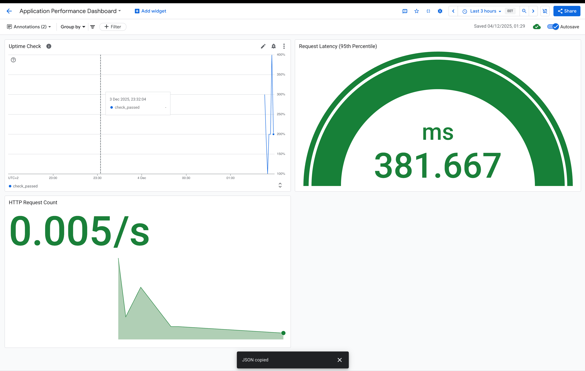
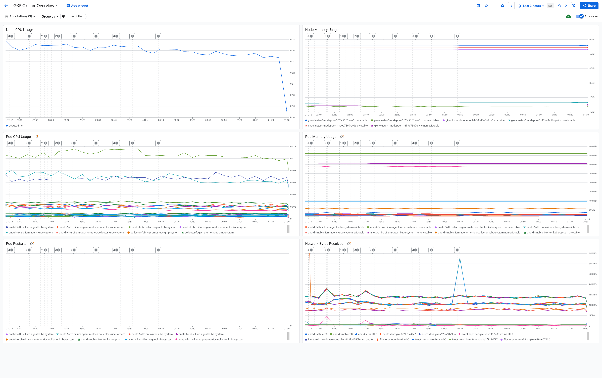

# Microservice Project Documentation

### 📁 Project Structure

```
.
├── helm
│   └── microservice-app-chart           # Helm chart for deploying microservice app
├── screenshots                          # Screenshots for dashboards,infra and app deployment
├── infra                                # Terraform scripts to provision GCP infrastructure
│   ├── acr.tf                           # Container Registry (GCP Artifact Registry)
│   ├── gke.tf                           # GKE cluster provisioning
│   ├── local.tf                         # Local variables & backend configuration
│   ├── modules                          # Reusable Terraform modules (e.g., GKE cluster, networking)
│   ├── monitoring.tf                    # Dashboards & metrics setup
│   ├── networking.tf                    # VPC, subnets, firewall rules
│   ├── provider.tf                      # Terraform provider configuration
│   ├── terraform.tf                     # Terraform initialization file
│   └── workload_identity.tf             # Workload Identity & IAM bindings
├── Microservices                        # Python microservice application
│   ├── app                              # Application code
│   ├── Dockerfile                       # Dockerfile to containerize the app
│   ├── requirements.txt                 # Python dependencies
│   └── run.py                           # Entry point for the app
└── README.md

```

## Requirements

- Terraform >= 1.12.2

- Google Cloud SDK (gcloud)

- Helm >= 3.0

- Docker >= 20.x


## 📦 Modules

### **modules/gke-cluster-standard**

Reusable GKE standard cluster module:

* Cluster creation
* Networking configuration
* Monitoring & logging
* Release channels

### **modules/gke-nodepool**

Reusable node pool module:

* Machine types
* Autoscaling configuration
* Node labels & taints

### **modules/net-vpc**

Creates VPC:

* Custom mode
* Subnets management

### **modules/net-vpc-firewall**

Defines firewall rules:

* SSH/IAP
* Health checks
* Internal traffic

### **modules/net-cloudnat**

Configures Cloud NAT for outbound internet access.

### **modules/net-address**

Reserves static external/internal IP addresses.

### **modules/workload-identity**

Manages:

* GCP SA
* IAM bindings
* Workload Identity federation

</br>
</br>

## 🚀 Usage Instructions

### Initialize Terraform

```
terraform init
```

This downloads all providers and modules.

### Validate Configuration
```
terraform validate
```

### Format Code

```
terraform fmt
```

### Preview Infrastructure Changes

```
terraform plan -out=plan.out
```

### Apply the Infrastructure

```
terraform apply plan.out
```

### Destroy Infrastructure (if needed)

```
terraform destroy
```

</br>
</br>

# 🚀 CI/CD Deployment Using GitHub Actions

This project includes support for deploying the infrastructure and application using **GitHub Actions**.
The deployment can occur automatically when pushing changes.


### 🔄 **Automated Deployment (Push to `main`)**

GitHub Actions can automatically run deployment pipelines when changes are pushed to the `main` branch.

### **Trigger Conditions**

The workflow runs on:

- **Application code updates**: changes under `./Microservices/**`

- **Helm chart/Kubernetes manifest updates**: changes under `./helm/microservice-app-chart/**`

---

## Screenshots

### **1. Application Deployment on GKE**


---

## 🏗️ Infrastructure Deployment Screenshots

### **2. Infra Deployment**


---
## 🏗️ Monitoring Dashboards Screenshots

### **2. Infra Deployment**



