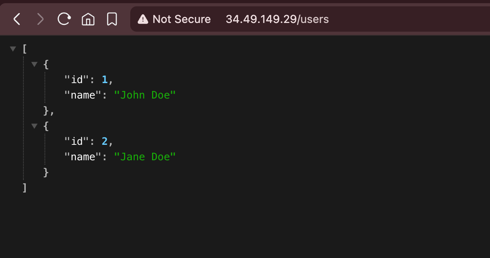
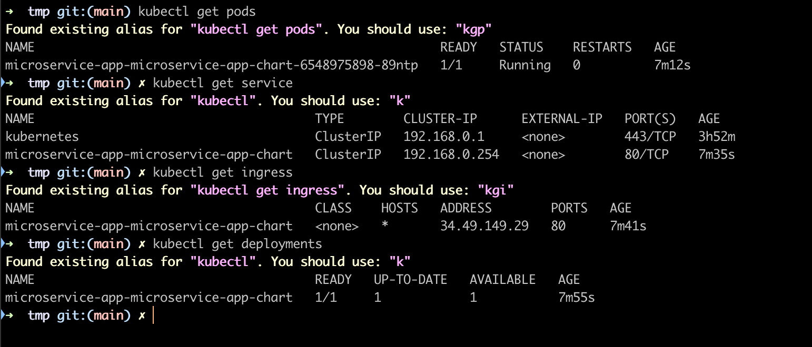
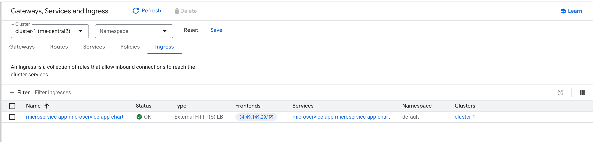
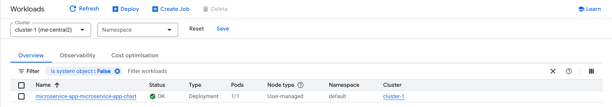
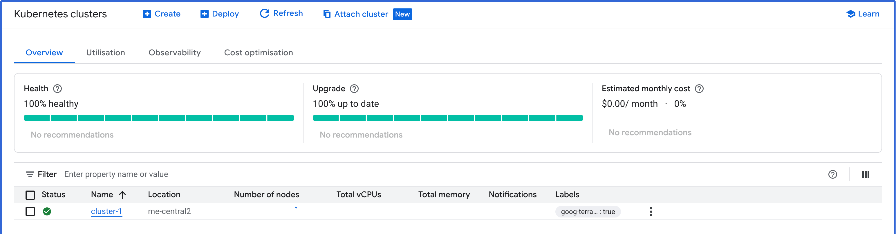

# Microservice Project Documentation

### 📁 Project Structure

```
.
├── acr.tf
├── gke.tf
├── local.tf
├── modules
│   ├── gke-cluster-standard
│   ├── gke-nodepool
│   ├── net-address
│   ├── net-cloudnat
│   ├── net-vpc
│   ├── net-vpc-firewall
│   └── workload-identity
├── networking.tf
├── provider.tf
├── terraform.tf
└── workload_identity.tf
```
---
### 📄 File & Module Overview

### **Root Terraform Files**

| File                     | Description                                                                          |
| ------------------------ | ------------------------------------------------------------------------------------ |
| **provider.tf**          | Defines Google Cloud provider configuration, authentication, and required providers. |
| **terraform.tf**         | Backend settings, Terraform version, and provider requirements.                      |
| **local.tf**             | Stores computed local variables used across the configuration.                       |
| **networking.tf**        | Declares VPC, subnets, firewall rules, NAT gateway, and IP ranges.                   |
| **gke.tf**               | Configures the GKE cluster and node pools using included modules.                    |
| **acr.tf**               | Creates Artifact Registry repositories (Docker, Helm, etc.).                         |
| **workload_identity.tf** | Manages Workload Identity bindings between GCP and GitHub Actions.      |


## 📦 Modules

### **modules/gke-cluster-standard**

Reusable GKE standard cluster module:

* Cluster creation
* Networking configuration
* Monitoring & logging
* Release channels

### **modules/gke-nodepool**

Reusable node pool module:

* Machine types
* Autoscaling configuration
* Node labels & taints

### **modules/net-vpc**

Creates VPC:

* Custom mode
* Subnets management

### **modules/net-vpc-firewall**

Defines firewall rules:

* SSH/IAP
* Health checks
* Internal traffic

### **modules/net-cloudnat**

Configures Cloud NAT for outbound internet access.

### **modules/net-address**

Reserves static external/internal IP addresses.

### **modules/workload-identity**

Manages:

* GCP SA
* IAM bindings
* Workload Identity federation

</br>
</br>

## 🚀 Usage Instructions

### Initialize Terraform

```
terraform init
```

This downloads all providers and modules.

### Validate Configuration
```
terraform validate
```

### Format Code

```
terraform fmt
```

### Preview Infrastructure Changes

```
terraform plan -out=plan.out
```

### Apply the Infrastructure

```
terraform apply plan.out
```

### Destroy Infrastructure (if needed)

```
terraform destroy
```

</br>
</br>

# 🚀 CI/CD Deployment Using GitHub Actions

This project includes support for deploying the infrastructure and application using **GitHub Actions**.
The deployment can occur automatically when pushing changes.

---

## 🔄 **Automated Deployment (Push to `main`)**

GitHub Actions can automatically run deployment pipelines when changes are pushed to the `main` branch.

### **Trigger Conditions**

The workflow runs on:

- **Application code updates**: changes under `./Microservices/**`

- **Helm chart/Kubernetes manifest updates**: changes under `./helm/microservice-app-chart/**`

---

## Screenshots

### **1. Application Deployment on GKE**





---

## 🏗️ Infrastructure Deployment Screenshots

### **2. Infra Deployment**





